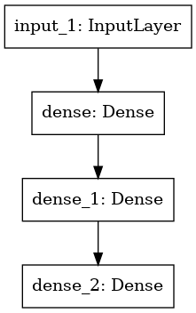
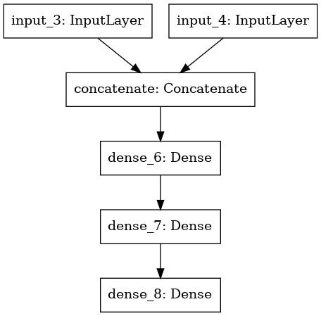

# MountainCarContinuous

## Theory

&emsp;**Agent** is using DDPG algorithm to predict continuous actions in continuous state space. It has two networks: Actor and Critic.

https://towardsdatascience.com/reinforcement-learning-w-keras-openai-actor-critic-models-f084612cfd69
  
https://towardsdatascience.com/hyper-parameters-in-action-part-ii-weight-initializers-35aee1a28404
  
https://spinningup.openai.com/en/latest/algorithms/ddpg.html

<b>Actor topology</b>

  

<b>Critic topology</b>

  

## Inputs/Outputs

&emsp;The Actor network has 2 inputs from game: position, velocity. The output layer consists from fully-connected 'tanh()' layer for doing actions in range (-1.0, 1.0): force. Hidden layers are using Exponential linear unit (ELU) function.

&emsp;The Critic network has 2 inputs from game (states) and 1 input from Actor network (action). The main function of this network is estimate quality of the action[t] in the state[t] and use it to change gradient of Actor network by equation: 

    grad_J = (dQ / daction) * (daction / dA)

    grad_J ->  policy gradient,
    Q      ->  Q value from Critic net on (state, action) pair,
    action ->  deterministic policy predicated by Actor,
    A      ->  Actor's weights

The Critic network is trained by Bellman equation:
    
    Q_target = reward + (1-done) * gamma * Q_next_state

    Q_target       ->  Q value to be trained,
    reward         ->  reward from game for action in state,
    gamma          ->  discount factor,
    Q_next_state   ->  quality of action in next state 
    done           ->  1, if it's terminal state or 0 in non-terminal state

<b>Summary</b>

  

<a href="https://app.wandb.ai/markub/mountain-car-continuous/runs/3i2z875k">For more charts click here.</a>

**Framework:** Tensorflow 2.0
 
**Languages:** Python 3 
 
**Author**: Martin Kubovcik
